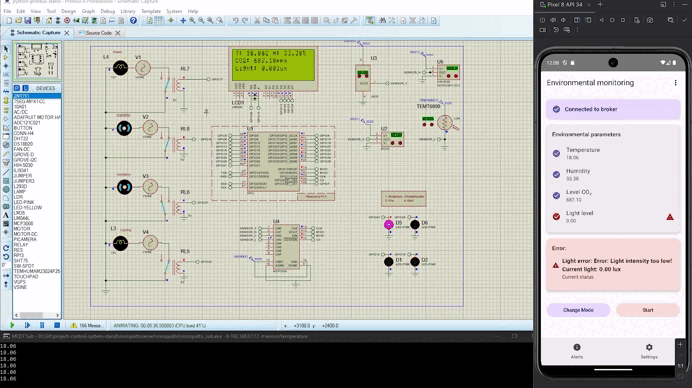

# 🐔 Poultry Farming Automation Project 🛠️

The project is designed to automate processes in poultry farming.  
The data collected by Raspberry Pi is converted and sent to the server as MQTT messages to specific topics.  
The mobile application subscribes to these topics to retrieve current parameters for display and system control.

## Implemented Components:

- **Stand in Proteus** based on **Raspberry Pi 3**, including:  
  - Electronic sensors (temperature, humidity, etc.)  
  - Actuators (e.g., relays)  
  - LED indicators  
  - LED display  
  - Analog-to-digital converter (ADC)

- **Mobile application** for monitoring environmental parameters and controlling actuators.

- **Mosquitto MQTT server configuration** for data exchange between the stand and the application.

## ⚙️ Example of Operation

## 🧪 Proteus Notes

- Proteus version: **8.16.SP3**  
- Since Proteus uses only libraries from its environment, additional libraries need to be downloaded and placed in the following path:  
  `C:\Program Files (x86)\Labcenter Electronics\Proteus 8 Professional\Tools\Python\Lib`  
- Library used for setting up the LED display:  
  [RPLCD — GitHub](https://github.com/dbrgn/RPLCD)

## 📱 Cura Application Notes

The mobile application is currently under development.

### Implemented features:

- Connecting to the MQTT server using the **Eclipse Paho Android Service** library.  
- Subscribing to topics to receive data from the Raspberry Pi (temperature, humidity, device statuses).  
- Displaying current parameters in real time.

### MQTT libraries used:

- `org.eclipse.paho:org.eclipse.paho.android.service` — service for working with MQTT on Android.  
- `org.eclipse.paho:org.eclipse.paho.client.mqttv3` — MQTT client library.

## 🖥️ Server Notes

- The project uses the **Mosquitto MQTT broker**.  
- Official website and documentation: [https://mosquitto.org/](https://mosquitto.org/)  
- The server runs on a PC and is responsible for receiving messages from devices (publishers) and forwarding them to subscribers.  
- Server setup includes:  
  - Running Mosquitto on a PC (Windows).  
  - Configuring ports and access (details in the repository: [mosquittoserver configuration](https://github.com/Xamiko/project-control-system-stand/tree/main/mosquittoserver)).  
- Clients (Raspberry Pi and mobile application) connect to the broker via local network or internet using the broker’s IP address and port.

## 🔥 Fire Detection Machine Model Notes

- In progress
